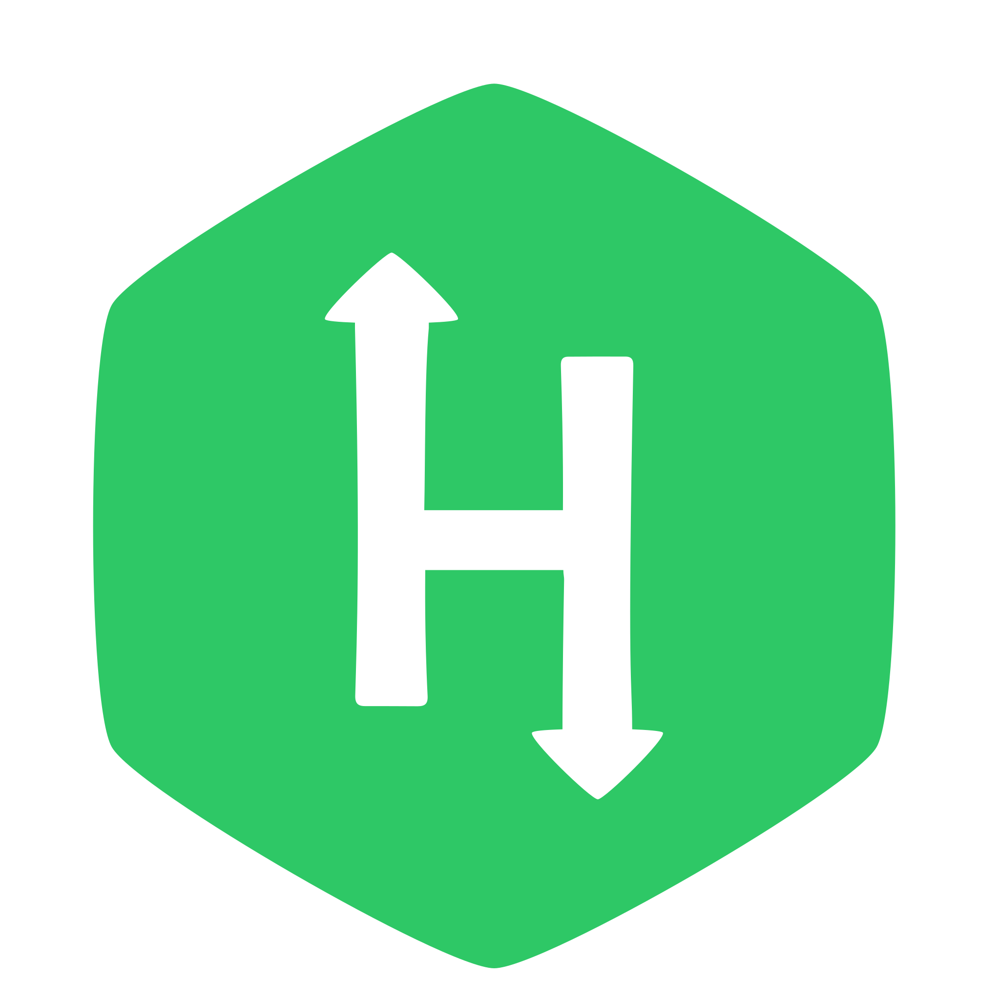

# Fitia Ismael Rakotondrazaka

# 👋 Hello, I'm Ismael
I'm a **professional web developer** with a passion for building user-friendly applications.

# 🥇 Skills
I am a highly dynamic and organized individual who can work effectively both independently and as a part of a team.\
I am always willing to adapt to new situations and challenges.\
I have worked on various web projects and continue to learn and develop my skills.

## Technical skills

### Programming languages

### Frameworks an libraries

### DMS

### Tools & extras

# 📊 Statistics

# 📞 How to reach me
Please feel free to reach out to me if you have any questions or would like to collaborate on a project.\

# ➕ More
Apart from web development, I am also interested in **competitive programming** and **artificial intelligence**.\
I am constantly learning and growing as a developer and look forward to contributing to exciting projects.

## 🙏 Thanks for checking out my profile.
